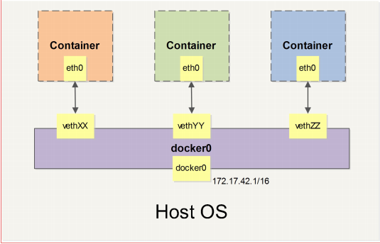

# Docker 入门

## Why Docker

###docker相对于传统容器的优势
①：更高效的利用系统资源  
由于容器不需要进行硬件虚拟化以及完整操作系统等额外开销，Docker对资源的利用率更高，无论是应用执行速度，内存损耗，以及文件读写速度  
②：更快速的启动时间  
传统容器启动需要几分钟，Docker依赖于宿主机内核，不需要启动完整的操作系统，因此可以做到秒级甚至毫秒级的启动，节约开发时间  
③：一直的运行环境
常见的环境差异可能会导致系统出现不同的问题，docker确保了应用在运行时的环境一致  
④：持续集成和交付  
开发人员可以通过定制镜像来实现持续集成、持续交付、部署。  
⑤：更轻松的迁移  
由于docker保证了运行时的环境一致，docker可以在很多平台上运行，且不会出现环境差异而导致的问题  

## docker 命令
###基本命令
进入容器：docker run -it  ubuntu:14.04 bash  
-i 交互式操作  
-t 终端  
列出镜像：docker images  
中间层镜像：docker images -a  
列出部分镜像： docker images ubuntu（列出ubuntu相关的镜像）  
列出所有镜像得id： docker images -q  

###创建镜像  
docker run -t -i training/sinatra /bin/bash   //启动一个新的docker  
gem install json  //装一个ruby包    
docker commit -m "Added json gem" -a "Docker Newbee" 83d4811a5839 ouruser/sinatra:v2 //  id由shell中的决定  
docker run -it 58967481793b  //  跑刚提交那个容器  
gem list  // 检查是否是刚那个容器  
### 利用dockerfile 创建镜像
mkdir dockerfiledic  
cd dockerfiledic  
touch Dockerfile  
```
RUN apt-get -qq update
RUN apt-get -qqy install ruby ruby-dev
RUN gem install sinatra
```
docker build -t="ouruser/sinatra:v2" .  
-t 新环境没名称   . file的位置  


移除镜像  
>docker rmi 58967481793b  

清理之前没打过标签的镜像  
>sudo docker rmi $(docker images -q -f "dangling=true")  

## Docker 容器

### 运行容器
docker run 9b9cb95443b5 /bin/echo "hello "  
docker run -i -t 9b9cb95443b5 /bin/bash  
后台运行:  
docker run -idt ubuntu  
docker ps  
docker attach nostalgic_hypatia  \
docker rm $(docker ps -a -q)  
创建一个数据卷      
>docker run -d -P --name web -v /webapp training/webapp python app.py

挂载一个主机目录作为数据卷  
>docker run -d -P --name web -v /src/webapp:/opt/webapp training/webapp python app.py  

挂在一个主机文件作为数据卷  
>sudo docker run --rm -it -v ~/.bash_history:/.bash_history ubuntu /bin/bash  

如果有一些数据需要在容器间共享，就需要挂载数据卷  
docker run -d -v /data --name dbdata training/postgres echo hello java  
docker run -d --volumes-from dbdata --name db1 training/postgres  
docker run -d --volumes-from dbdata --name db2 training/postgres  


docker rm $(docker stop $(docker ps -a -q))  //移除所有容器

启动网络容器：
docker run -d -p 6379:9000 redis  运行redis 并将端口映射到9000  
docker ps 查看docker的进程  
docker logs 3167a9d39c02  查看Redis的日志  
docker run -d -p 0.0.0.0:6379:9000 redis  运行redis 并将端口映射到主机9000  
docker run -d -p 0.0.0.0::9000 redis  运行redis 并将端口映射到主机任意端口  
docker run -d -p 127.0.0.1:5000:5000/udp redis  映射UDP端口  
docker port 3167a9d39c02 6379  查看容器映射端口  
docker run -d -p 5000:5000 -p 3000:80 redis  映射多个端口  

####docker网络容器的高级配置
当docker启动时会在主机创建一个docker0的虚拟网桥，实际上是linux的一个bridge，可以理解为一个网络交换机，他会在挂在他的网口之前进行转发  
同时，docker随机分配一个本地未占用的私有网段中的地址给docker0接口，比如典型的172.17.42.1，掩码为255.255.0.0，伺候启动容器也会自动分配一个同一网段  
当创建一个容器的时候，同时也会创建一对veth pair接口，（当数据包发送到一个接口的时候，另外一个接口也可以收到相同的数据包），这对接口一段在容器内即eth0，另一端在本地并被挂在到docker0网桥，名为veth的开台，通过这种方式，容器可以和主机通信，也可以和容器通信  


###快速装配  
#### docker服务启动时候装配
-b BRIDGE or --bridge=BRIDGE --指定容器挂载的网桥  
--bip=CIDR --定制 docker0 的掩码  
-H SOCKET... or --host=SOCKET... --Docker 服务端接收命令的通道  
--icc=true|false --是否支持容器之间进行通信  
--ip-forward=true|false --请看下文容器之间的通信  
--iptables=true|false --是否允许 Docker 添加 iptables 规则   
--mtu=BYTES --容器网络中的 MTU  
#### 服务启动或者容器启动时候装配
--dns=IP_ADDRESS... --使用指定的DNS服务器  
--dns-search=DOMAIN... --指定DNS搜索域
#### 容器启动时候装配
 -h HOSTNAME or --hostname=HOSTNAME --配置容器主机名  
 --link=CONTAINER_NAME:ALIAS --添加到另一个容器的连接  
 --net=bridge|none|container:NAME_or_ID|host   --配置容器的桥接模式  
 -p SPEC or --publish=SPEC --映射容器端口到宿主主机
 -P or --publish-all=true|false --映射容器所有端口到宿主  

iptables -t nat -nL 查看主机的NAT规则  
### 创建一个点与点的连接  
```
默认情况下，Docker 会将所有容器连接到由 docker0 提供的虚拟子网中。
用户有时候需要两个容器之间可以直连通信，而不用通过主机网桥进行桥接。
解决办法很简单：创建一对 peer 接口，分别放到两个容器中，配置成点到点链路类型即
可。
首先启动 2 个容器：
$ sudo docker run -i -t --rm --net=none base /bin/bash
root@1f1f4c1f931a:/#
$ sudo docker run -i -t --rm --net=none base /bin/bash
root@12e343489d2f:/#
找到进程号，然后创建网络命名空间的跟踪文件。
$ sudo docker inspect -f '{{.State.Pid}}' 1f1f4c1f931a
2989
$ sudo docker inspect -f '{{.State.Pid}}' 12e343489d2f
3004
$ sudo mkdir -p /var/run/netns
$ sudo ln -s /proc/2989/ns/net /var/run/netns/2989
$ sudo ln -s /proc/3004/ns/net /var/run/netns/3004
创建一对 peer 接口，然后配置路由
$ sudo ip link add A type veth peer name B
$ sudo ip link set A netns 2989
$ sudo ip netns exec 2989 ip addr add 10.1.1.1/32 dev A
$ sudo ip netns exec 2989 ip link set A up
$ sudo ip netns exec 2989 ip route add 10.1.1.2/32 dev A
$ sudo ip link set B netns 3004
$ sudo ip netns exec 3004 ip addr add 10.1.1.2/32 dev B
$ sudo ip netns exec 3004 ip link set B up
$ sudo ip netns exec 3004 ip route add 10.1.1.1/32 dev B
现在这 2 个容器就可以相互 ping 通，并成功建立连接。点到点链路不需要子网和子网掩码。
此外，也可以不指定 --net=none 来创建点到点链路。这样容器还可以通过原先的网络来通
信。
实例：创建一个点到点连接
95
利用类似的办法，可以创建一个只跟主机通信的容器。但是一般情况下，更推荐使用 --
icc=false 来关闭容器之间的通信
```

### 网桥
centos建设网桥
yum install bridge-utils  
yum install tunctl  

## DockerFile 
docker是一行行命令语句构成， 可以用#来进行注释  
一般的，Dockerfile 分为四部分：基础镜像信息、维护者信息、镜像操作指令和容器启动时执行指令。  
```
# This dockerfile uses the ubuntu image
# VERSION 2 - EDITION 1
# Author: docker_user
# Command format: Instruction [arguments / command] ..
# Base image to use, this must be set as the first line
FROM ubuntu
# Maintainer: docker_user <docker_user at email.com> (@docker_user)
MAINTAINER docker_user docker_user@email.com
# Commands to update the image
RUN echo "deb http://archive.ubuntu.com/ubuntu/ raring main universe" >> /etc/apt/sources.list
RUN apt-get update && apt-get install -y nginx
RUN echo "\ndaemon off;" >> /etc/nginx/nginx.conf
# Commands when creating a new container
CMD /usr/sbin/nginx
```

```
# Nginx
#
# VERSION 0.0.1
FROM ubuntu
MAINTAINER Victor Vieux <victor@docker.com>
RUN apt-get update && apt-get install -y inotify-tools nginx apache2 openssh-server
# Firefox over VNC
#
# VERSION 0.3
FROM ubuntu
# Install vnc, xvfb in order to create a 'fake' display and firefox
RUN apt-get update && apt-get install -y x11vnc xvfb firefox
RUN mkdir /.vnc
# Setup a password
RUN x11vnc -storepasswd 1234 ~/.vnc/passwd
# Autostart firefox (might not be the best way, but it does the trick)
RUN bash -c 'echo "firefox" >> /.bashrc'
EXPOSE 5900
CMD ["x11vnc", "-forever", "-usepw", "-create"]
# Multiple images example
#
# VERSION 0.1
FROM ubuntu
RUN echo foo > bar
# Will output something like ===> 907ad6c2736f
FROM ubuntu
RUN echo moo > oink
# Will output something like ===> 695d7793cbe4
# You᾿ll now have two images, 907ad6c2736f with /bar, and 695d7793cbe4 with
# /oink
```

### 指令

### docker compose 

### docker machine

### docker swarm

### coreos

### Kubernetes 

